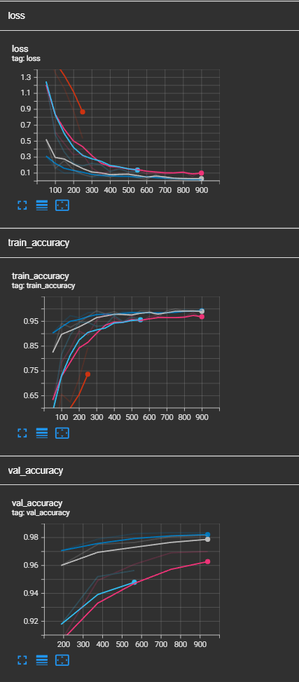

Modification of RWKV V6 RNN mode to support batches of data

increasing size of the model increases performance as expected

at the moment only the mnist input dim of 28 works, I haven't debugged 1 yet

Training using [PyTorch Lightning](https://github.com/williamFalcon/pytorch-lightning).

#### Visualization

